Hi, I'm Alex, a fullstack developer in Zürich. I've been writing code since I was 16, starting as an apprentice at Swisscom, and these days I'm on Amazon's Lens team, mostly React and TypeScript. Outside work I build things for classrooms and run a small homelab.

[zeitiv.dev](https://zeitiv.dev) · [LinkedIn](https://www.linkedin.com/in/alexander-gr%C3%A4del/)
